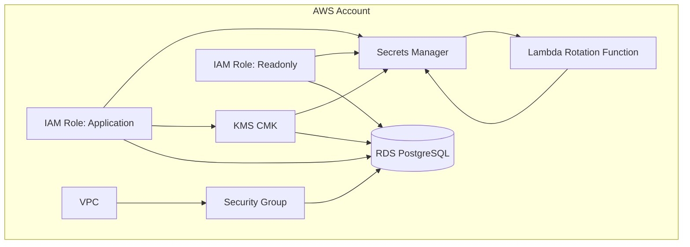
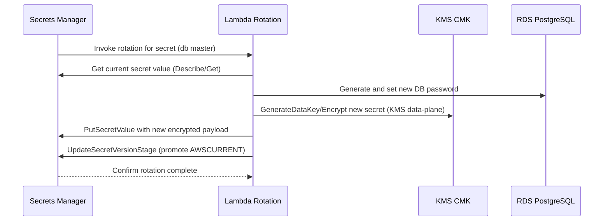

# AWS Secrets Encryption Solution

This repository provisions a complete secrets encryption and rotation foundation using Terraform for AWS. It integrates KMS, Secrets Manager, RDS (PostgreSQL), and IAM to enable:
- Encryption at rest for databases and secrets with KMS CMK.
- Automated secret rotation using Lambda and Secrets Manager rotation rules.
- Elimination of hardcoded credentials by injecting secrets at deploy/run time.
- Least-privilege IAM roles for application workloads and auditing.

The Terraform project is modular, with dedicated modules for `kms`, `secrets-manager`, `rds`, and `iam`. It includes CI-based HCL linters and validation.

## Contents

- Modules:
  - `modules/kms`: Customer-managed KMS key, alias, key policy.
  - `modules/secrets-manager`: Secrets, initial randomized values, Lambda-based rotation.
  - `modules/rds`: Encrypted PostgreSQL DB with credentials sourced from Secrets Manager.
  - `modules/iam`: Roles and policies for application and read-only access.
- Root configuration:
  - `main.tf`: Wires modules together and propagates variables and outputs.
  - `variables.tf`: Tunable inputs for regions, names, instance sizes, rotation windows, etc.
  - `outputs.tf`: Useful identifiers for integration and observability.
- CI:
  - `.github/workflows/ci.yml`: Terraform fmt, validate, and TFLint checks.
- VCS housekeeping:
  - `.gitignore`: Ignores Terraform state/plan files, Lambda artifacts, and local environment files.

## Architecture

The design enforces encryption and secret hygiene as first-class concerns.

- AWS KMS:
  - One CMK tied to environment and project.
  - Key rotation enabled (configurable).
  - Strict key policies for admin and data-plane users.
- AWS Secrets Manager:
  - Stores database master credentials, application API keys, and app configuration secrets.
  - Randomized values generated at deploy-time via `random_password`.
  - Automated rotation for DB master credentials using Lambda.
- AWS Lambda:
  - Rotation function for Secrets Manager.
  - Scoped IAM permissions to read and update the targeted secret and use KMS.
- AWS RDS (PostgreSQL):
  - Encrypted storage via KMS CMK.
  - Credentials pulled from Secrets Manager at deploy time.
  - Private networking (non-public) with security group ingress restricted to the VPC CIDR.
- AWS IAM:
  - Application role with least-privilege access to specific secrets and KMS data-plane.
  - Read-only role for audits and minimal introspection.

### Component Diagram

### Secret Rotation Flow

### Encryption At Rest Validation

- RDS:
  - `storage_encrypted = true` and `kms_key_id = module.kms.key_id`
  - Performance Insights encryption is enabled with the same CMK.
- Secrets Manager:
  - `kms_key_id` is explicitly set for each secret.
  - Secret payloads are encrypted via KMS before storage.
- KMS:
  - Data-plane permissions are confined to `kms:Encrypt`, `kms:Decrypt`, `kms:GenerateDataKey*`, `kms:ReEncrypt*`, `kms:DescribeKey`.
  - Key rotation can be enabled via variable (`enable_key_rotation`).

## Service Communication and Permissions

- Lambda Rotation function:
  - Reads the target secret, updates it, and writes the rotated value.
  - Uses KMS to encrypt/decrypt as part of the rotation.
  - Has CloudWatch Logs permissions for observability.
- Application Role:
  - Can only read specific secret ARNs and use KMS data-plane actions against the CMK.
  - Can describe RDS instances for topology awareness.
- Readonly Role:
  - Read-only capability for describe/list operations and reading specified secrets.
- KMS Key Policy:
  - Grants root account admin.
  - Optional admin and user role ARNs can be passed to widen admin/data-plane actions via variables.

## Eliminating Hardcoded Credentials

- Initial credentials are generated by `random_password` resources.
- Secrets are stored in Secrets Manager and never hardcoded in Terraform variables beyond structure fields like usernames and DB names.
- RDS credentials are fetched from the secret at deploy time (`aws_secretsmanager_secret_version` data source).
- Applications retrieve secrets at runtime via IAM and Secrets Manager.

## Prerequisites

- Terraform >= 1.0
- AWS credentials configured in your environment (e.g., via AWS SSO or environment variables).
- An existing VPC and private subnets provided via input variables.

## Getting Started

1. Copy example variables and adjust:
   - Create `terraform.tfvars` from `terraform.tfvars.example`.
   - Set `vpc_id`, `subnet_ids`, and any environment-specific parameters.

2. Initialize and plan:
   - `terraform init`
   - `terraform fmt -recursive`
   - `terraform validate`
   - `terraform plan`

3. Apply:
   - `terraform apply`

4. Retrieve outputs:
   - `terraform output`
   - Sensitive outputs are masked; query specific outputs as needed:
     - `terraform output kms_key_arn`
     - `terraform output rds_endpoint`
     - `terraform output app_role_arn`

## Commands to Check the Project

- HCL formatting check:
  - `terraform fmt -check -recursive`
- Validate configuration:
  - `terraform validate`
- Lint with TFLint (initialized via CI):
  - `tflint --init`
  - `tflint` (run at repository root and per module directory)
- Inspect module graph:
  - `terraform graph | dot -Tpng > graph.png` (requires Graphviz)
- Inspect applied resource states (locally, without backend):
  - `terraform state list`
- Query specific attributes:
  - `terraform state show module.rds.aws_db_instance.main`

## CI Linters and Validation

GitHub Actions workflow at `.github/workflows/ci.yml` runs:
- `terraform fmt -check -recursive`
- `terraform validate`
- `tflint` (with AWS ruleset enabled)

This ensures consistent formatting, syntactic validity, and common AWS best practices are enforced at PR time.

## Variables Overview

Key inputs in `variables.tf`:
- `aws_region`: Region to deploy resources.
- `project_name`, `environment`: Namespacing for all resources.
- `enable_key_rotation`, `kms_deletion_window`, `kms_admin_role_arns`, `kms_user_role_arns`: KMS configuration.
- `enable_secret_rotation`, `secret_rotation_days`, `secret_recovery_window`: Secrets Manager configuration.
- `database_credentials`: Initial DB username/database (password is randomized).
- `vpc_id`, `subnet_ids`: Networking for RDS.
- `db_instance_class`, `db_allocated_storage`, `db_engine_version`, `db_backup_retention`, `db_enabled_cloudwatch_logs`: RDS settings.

## Security Notes

- Sensitive outputs are marked as sensitive where applicable.
- Lambda rotation IAM policy restricts access to the specific secret ARN and KMS key.
- KMS Key Policy includes optional admin and user role ARNs to scope operational responsibilities.
- RDS credentials are never stored in plain text in the codebase; live password is generated.
